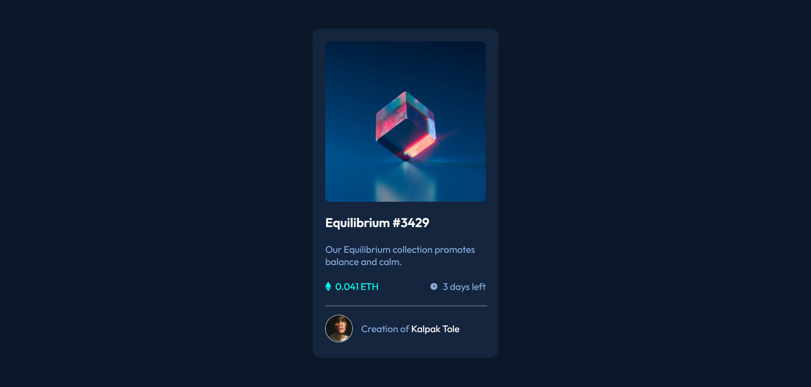
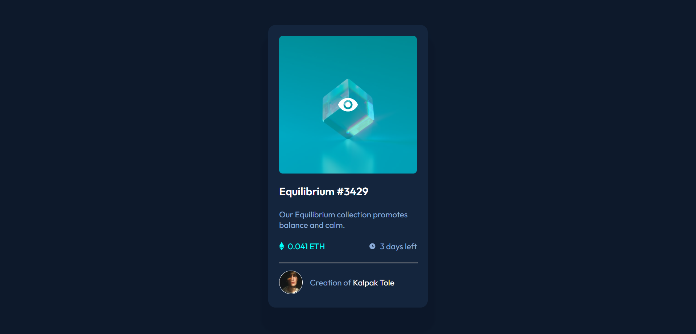
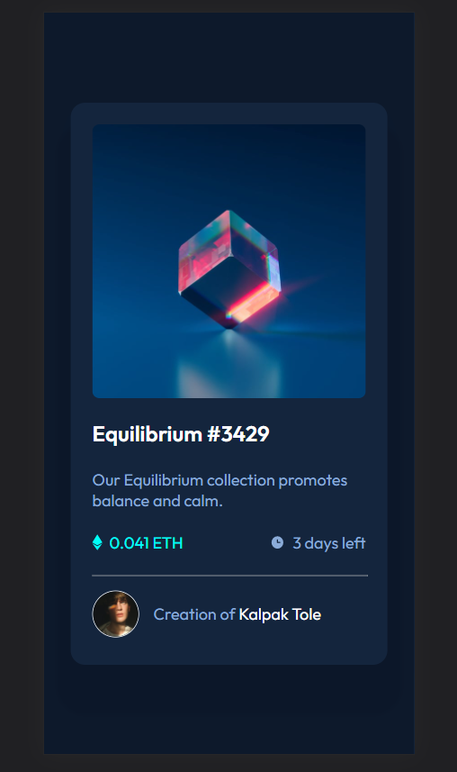

# Frontend Mentor - NFT preview card component solution

This is a solution to the [NFT preview card component challenge on Frontend Mentor](https://www.frontendmentor.io/challenges/nft-preview-card-component-SbdUL_w0U). Frontend Mentor challenges help you improve your coding skills by building realistic projects.

## Table of contents

-   [Overview](#overview)
    -   [The challenge](#the-challenge)
    -   [Screenshot](#screenshot)
    -   [Links](#links)
-   [My process](#my-process)
    -   [Built with](#built-with)
    -   [What I learned](#what-i-learned)
    -   [Useful resources](#useful-resources)
-   [Author](#author)
-   [Acknowledgments](#acknowledgments)

## Overview

### The challenge

Users should be able to:

-   View the optimal layout depending on their device's screen size
-   See hover states for interactive elements

### Screenshot

#### Desktop View



#### Desktop View Active State



#### Mobile View



### Links

-   Solution URL: [Solution on Github](https://github.com/KalpakTole/nft-preview-card-component-main)
-   Live Site URL: [Vercel Live Site](https://nft-preview-card-component-five.vercel.app/)

## My process

### Built with

-   Semantic HTML5 markup
-   CSS custom properties
-   Flexbox

### What I learned

I loved the way I made the Cyan overlay on image over and the eye logo at the center of the image!

HTML:

```html
<div class="img-overlay">
	
</div>
```

CSS:

```css
.img-overlay {
	position: absolute;
	background: var(--cyan);
	width: inherit;
	aspect-ratio: 1;
	border-radius: 0.5rem;
	z-index: 1010;
	opacity: 0;
	display: flex;
	align-items: center;
	justify-content: center;
	cursor: pointer;
}

.img-overlay:hover {
	background: hsla(178, 100%, 50%, 0.5);
	opacity: 1;
}

.eye {
	color: white;
}
```

### Useful resources

-   [Kevin Powell](https://www.youtube.com/kepowob)'s YT Channel - This helped me in learning so many new things in CSS!

## Author

-   Github - [KalpakTole](https://github.com/KalpakTole)
-   Frontend Mentor - [@KalpakTole](https://www.frontendmentor.io/profile/KalpakTole)
-   Twitter - [@KalpakTole](https://twitter.com/KalpakTole)

## Acknowledgments

I have been watching a lot of [Kevin Powell](https://www.youtube.com/kepowob)'s videos recently and they have helped me learn many new things in CSS in a fast and easy manner!
